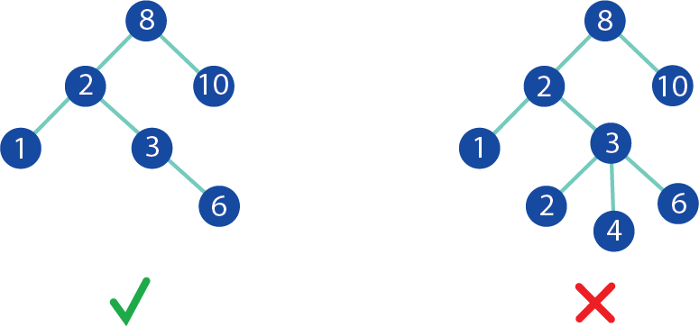
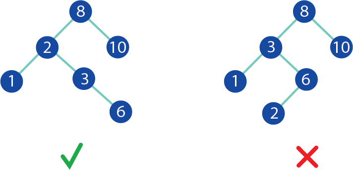
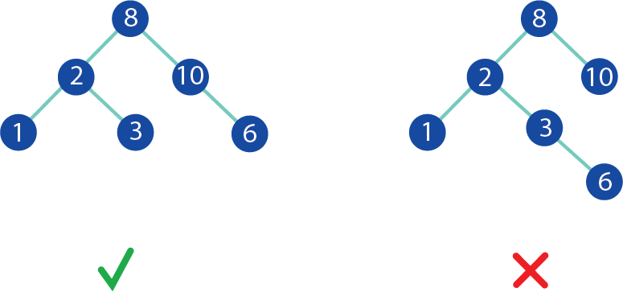

## Table of Contents
### Welcome
- [Welcome Page](../Welcome.md)
### Prepare
- Overview
- Binary Trees
  - Efficiency
- Binary Search Tress (BST)
  - Efficiency
- Balanced Binary Search Trees (Balanced BST)
  - Efficiency
- C# Syntax -
- Common Errors
- Example
- Problem to Solve

### Applications
- Family Trees
- File Management
- Organizing different departments
- Nested data like JSON and XML files

### Tree Demo and Exercise
- [Trees Demo](TreesDemo.cs)
- [Trees Exercise](Trees.cs)
- [Trees Exercise Solution](Solution.cs)

## Overview
A tree is a data structure of connected nodes. It is similar to a linked list, but contains multiple branches. There are quite a few different types of trees. They have various efficiencies, advantages, and disadvantages. 
For our purpose we will go over the most common; Binary Trees, (BST) Binary Search Trees, and (Balanced BST) Balanced Binary Search Trees.

Throughout this lesson various labels will be used. Refer back to this image for clarification if needed.

### Binary Trees
A binary tree is the simplest form of a tree. A tree in which each node has at most two children, referred to as the left child and the right child.
In the image below the tree on the left is not a binary tree because some of the nodes contain 3 children. 

#### Efficiency: O(n)
Because there is no guarantee of a binary tree being sorted, worst case scenario every node has to be checked resulting in O(n).

### Binary Search Trees (BST)
A binary search tree (BST) is a sorted tree where the left subtree of a node contains only nodes with values less than the parent node's value, and the right subtree contains only nodes with values greater than the parent node's value.
Below is an example to help visualize this. The tree on the right is not a BST because the node "6" has a left child with a value of "2" which is less than the parent node "3".

#### Efficiency: O(n)
Binary Search Trees are often found to be more efficient than a Binary tree. When balanced the search is cut in half at each node resulting in O(log n). However if a BST becomes unbalanced the efficiency quickly degrades to O(n) because every node has to be searched.

### Balanced Binary Search Trees (Balanced BST)
In a balanced BST, the heights of the left and right subtrees of every node differ by at most 1, and both the left and right subtrees are also balanced.
The height is calculated by counting the number of nodes from the root to the leaf node. On the left the height is 3. On the right tree the height is 4, but the right only has a height of 2 creating a difference of 2.

#### Efficiency: O(log n)
Balance BST have an efficiency of O(log n) because the search is cut in half at each node.

#### C# Syntax 
Trees often use Recursion insteadx
##### [Trees Demo](TreesDemo.cs)

#### Common Errors
- Attempting to access a node when it is null. Solution: Always check for null before altering nodes.
- Failure to update parent pointers. Solution: Identify the error and update the pointers.

### [Trees Exercise](Trees.cs)
Oh no! The Christmas Playlist you merged using a set is out of order. Lets organize it alphabetically using a Binary Search Tree.
Most of the Program is written for you, but you will have to use your knowledge of Trees, and the Trees Demo to write the code that
places the current song on the left or right subtree, depending on how its spelling compares to the other nodes.

[Trees Exercise Solution](Solution.cs)

