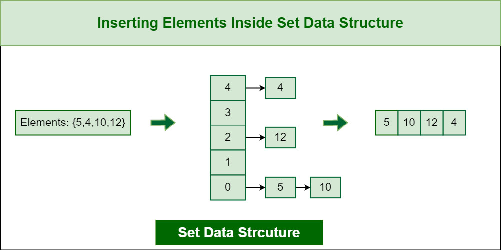

## Table of Contents

### Welcome
- [Welcome Page](../Welcome.md)

### Prepare
- Overview
- Characteristics
- Hashsets
- Conflicts
- C# Syntax - Add, Remove, Contains, & Count
- Efficiency of common operations
- Common Errors
- Example
- Problem to Solve

### Applications
- Inventory Management
- Identifying mutual friends on Socials
- Course Enrollment
- Check Membership

### Set Demo and Exercise
- [Set Demo](../Sets/SetsDemo.cs)
- [Set Exercise](../Sets/Sets.cs)
- [Set Exercise Solution](../Sets/Solution.cs)

## Overview
A set is a fundamental data structure in computer science that represents a collection of distinct elements with no duplicates. It is often used to work with unique data, perform set operations, and efficiently check for membership.



#### Characteristics
- Uniqueness: Sets only store unique elements. Duplicate elements are automatically removed.
- No Specific Order: Sets do not guarantee any specific order for the elements.

#### Hashsets
Hashset is a specific implementation of the Set. They organize data by using hash tables. They hashing to map elements, allowing for more efficient time complexity for common set operations like add, remove, and contains. This is crucial when dealing with large datasets.
The use of the index(n) hashing function is what gives us the O(1) timing.

#### Dealing with Collisions
Since sets use fixed storage arrays there is a high chance conflicts will arise when the array is full. To deal with this conflict there are 2 common solutions.
- open addressing: if the space is already occupied it looks at the space to the right. This simple solution can cause further conflicts if there is no open spaces.
- chaining: if the space is already occupied a linked list is created and "chains" the values together. The draw back of this solution is that the Efficiency can become O(n).


#### C# Syntax - Add, Remove, Contains, Count, Intersect, & Union
To set up and use a Set follow these steps:
1. Create a Hashset

   Ex. ```HashSet<int> numberSet = new HashSet<int>();```

2. Add values

   Ex. ```numberSet.Add(value);```

At this point you can manipulate the data using
- Remove: ```numberSet.Remove(value):```	Removes the “value” from the set
- Member: ```numberSet.Contains(value):```	Determines if “value” is in the set
- Size: ```numberSet.Count();```
- Intersect: Creates a new set of duplicate values ```numberSet.intersection(numberSet2);```
- IntersectWith: Replaces sets with 1 set of duplicate values  ```numberSet.intersection(numberSet2);```
- Union: Creates a new set with unique values from 2 sets. ```numberSet.Union(numberSet2);```
- UnionWith: Replaces sets with 1 combined set. ```numberSet.UnionWith(numberSet2);```

#### Efficiency of common operations
Because of Hashsets the efficiency of common operations is O(1) assuming there is efficient conflict resolution.

#### Common Errors
- Assuming the order in which items are added will be maintained. Solution: If order is critical, you should use a data structure like a list.
- Using mutable elements. If an element is modified after being added to the set, it may cause unexpected behavior. Solution: Only use immutable elements.
- Mixing types of elements can lead to errors. Solution: Practice keeping the elements of a set of the same type.
- Attempting to alter, such as removal of an element that does not exist. Solution: cCheck if the element exists in the set before attempting to alter it to avoid errors.

### [Set Demo](../Sets/SetsDemo.cs)
A collector of baseball cards started with a collection of 10 cards. He wants to keep track of his collection. He wants to sell any duplicate cards, to save time he wants a program that will add each card, check if he already has it, and then give him a list of duplicate cards so he knows what to sell. 

### [Set Exercise](../Sets/Sets.cs)
You and a friend want to share Christmas Playlists. Write a program that will merge your playlists and get rid of any duplicates. Then remove any songs that are not Christmas songs. *Hints (Union and Remove)

[Set Exercise Solution](../Sets/Solution.cs)