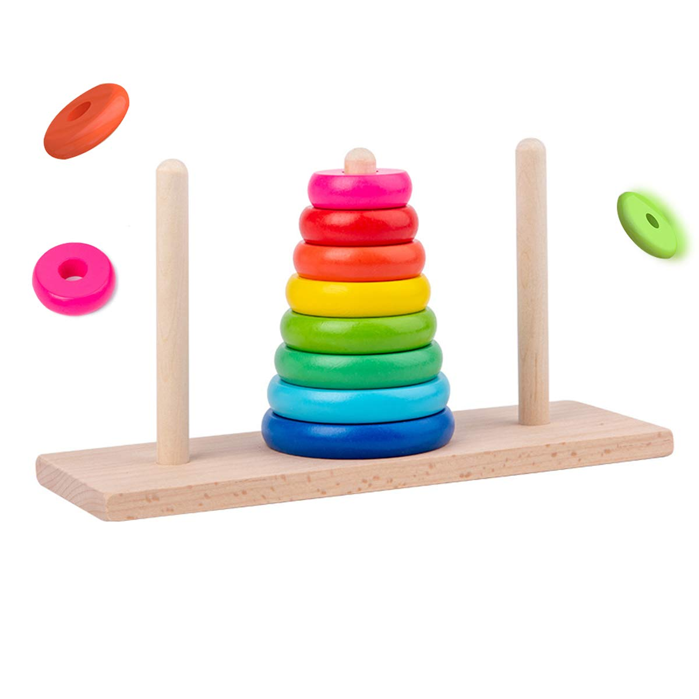
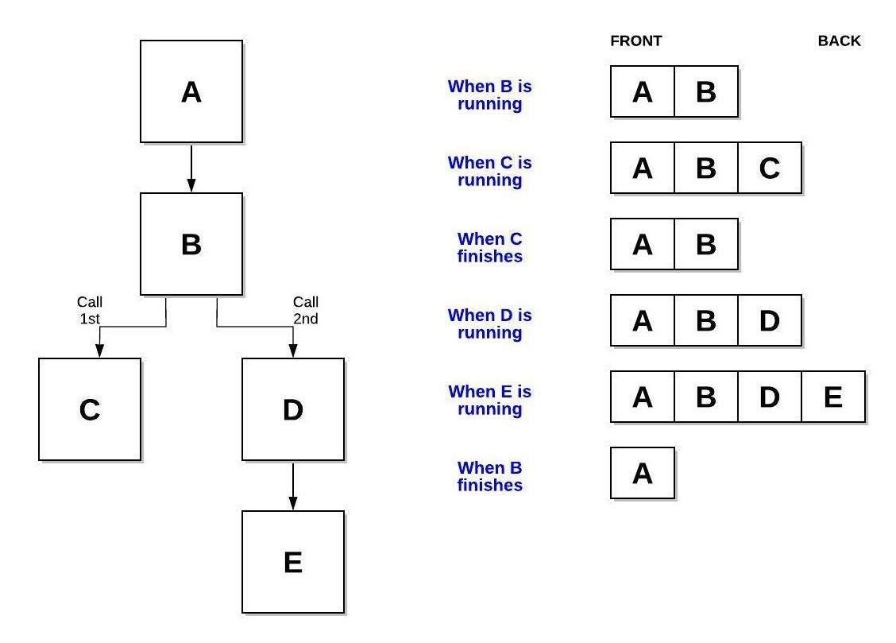

## Table of Contents

### Welcome
- [Welcome Page](../Welcome.md)

### Prepare
- Overview
- LIFO
- C# Syntax- Push & Pop
- Software and Stacks
- Efficiency of common operations
- Common Errors
- Example
- Problem to Solve

### Applications
- Browser History
- Function call management
- Undo such as on the keyboard
- Balanced Parenthesis ()[]{}

### Stack Demo and Exercise
- [Stack Demo](StacksDemo.cs)
- [Stack Exercise](Stacks.cs)
- [Stack Exercise Solution](Solution.cs)

## Overview
A stack is a data structure that is characterized by "Last In, First Out". Items can be added and removed from the end. Though stacks is a very simple data structure, it is useful for many instances.

#### "Last In, First Out" (LIFO)
LIFO means exactly what it sounds like. Whatever is placed in a stack last will be the first out.

A good example of this is the tower above. Blocks that were added first are covered by blocks that were added last. Thus making it so you can only manipulate the last added block.

#### C# Syntax - Push & Pop
In C# the code that allows you to use stacks is known as "push" and "pop". Push means to place in the stack, and Pop means to remove from the stack. An easy way to remember this is to think of a stack of legos. When a lego is placed in the stack it is pushed. When a lego is removed from the stack it is popped off. These are the only two functions used in Stacks. Now lets go over the syntax to set everything up.

Creating a Stack

First the Stack needs to be created. You do this by declaring what type of data will be stored within the stack, give it a name, and then initialize it as a new instance of the generic "Stack" data structure.

    Ex. Stack<int> numberStack = new Stack<int>();

Pushing Values into the Stack

To push values into the stack you use the following syntax: stackName.Push(value);

    Ex. numberStack.Push(1);

Popping Values from the Stack

To pop values from the stack you use the following syntax: stackName.Pop(value);

    Ex. numberStack.Pop();

It is worth being mentioned that the length of the stack by using stackName.Count();

#### Software and Stacks
Though you may think you are not familiar with stacks, they are used in many programming basics.
A few examples:
- Calling a function within a function. Function A is in the stack and is running, within function A function B is called. Function B is pushed in the stack and starts running. Function A will not be completed and popped off the stack until function B completes and is popped from the stack.

  

- IDEs checking if (), [], {}, and other tags are properly closed. When (, [, {, is read the opening tag is pushed into the stack, then when a closing tag comes up it pops the item in the stack and checks to see if it is a match. If it does not, it throws an error.

#### Efficiency of common operations
The push and pop operations of stacks have an efficiency of O(1). This is because no matter how long the list is the operations push or pop add or remove the last item of the list. There is no sorting or searching for items.

#### Common Errors
- Forgetting Stacks only follow the LIFO principle. Solution: if LIFO will not work for your project, it is likely another data structure should be used instead of a stack.
- Forgetting to initialize the stack.
- Forgetting that Stacks allow punctuation and spaces unless input is altered.
- Popping elements on an empty stack. Solution: Insert code that will check to see if the stack is empty before you attempt to pop.
- Stack Overflow - stacks often have a fixed sized. Pushing elements onto a full stack without checking for overflow can lead to memory corruption or unexpected crashes. Solution: Resize stack.
- Using the wrong data type. Solution: Check that the data type in the push value matches the type declared in the creation of the stack.

### [Stack Demo](StacksDemo.cs)
The demo provided tests whether a string is a Palindrome. This means that a string reversed is the same as the string itself. The class takes the input and pushes its characters into a stack. Then to reverse the input it pops it out into a new array and creates a string to compare to the original input. If "False" is returned the reversed string is shown to help you learn exactly how a Stack works.

### [Stack Exercise](Stacks.cs)
Create a program that adds songs to a playlist and plays the most recently added songs until all songs are played. Do this using the Stack "_playlist" by filling in the methods with the correct push or pop functions.

[Stack Exercise Solution](Solution.cs)